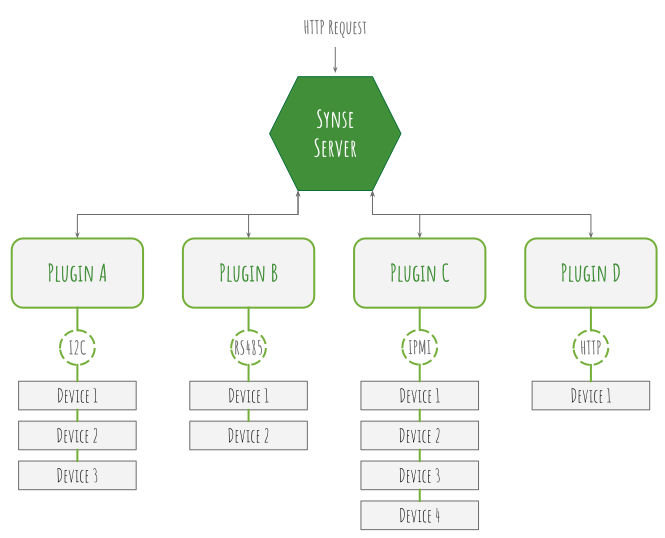

<p align="center"><a href="https://www.vapor.io/"></a></p>
<p align="center">
    <a href="https://circleci.com/gh/vapor-ware/synse-server"></a>
    <a href="https://codecov.io/gh/vapor-ware/synse-server"></a>
    <a href='http://synse-server.readthedocs.io/en/latest/?badge=latest'></a>
        
<h1 align="center">Synse Server</h1>
</p>

<p align="center">An HTTP API for the monitoring and control of physical and virtual devices.</p>


Synse Server provides a simple HTTP API to monitor and control physical and virtual devices
at any scale: from home automation to data center infrastructure. It exposes devices managed
by protocol specific plugins, such as RS-485, I²C, and IPMI, though a uniform HTTP interface.
This makes it possible to read from, write to, get metainfo, and scan for devices across
multiple back-ends all through a cURL-able interface.

For more detailed information on Synse Server, its API, and how to develop with it, see
the [User Guide][user-guide] and the [API Documentation][synse-api].

## The Synse Ecosystem
Synse Server is one component of the greater Synse Ecosystem.

- [**vapor-ware/synse-cli**][synse-cli]: A CLI that allows you to easily interact with
  Synse Server and Plugins directly from the command line.

- [**vapor-ware/synse-graphql**][synse-graphql]: A GraphQL wrapper around Synse Server's
  HTTP API that provides a powerful query language enabling simple aggregations and
  operations over multiple devices.

- [**vapor-ware/synse-sdk**][synse-sdk]: The official SDK (written in Go) for Synse Plugin
  development.

- [**vapor-ware/synse-server-grpc**][synse-grpc]: The internal gRPC API that connects Synse
  Server and the Synse Plugins.

- [**vapor-ware/synse-emulator-plugin**][synse-emulator]: A simple plugin with no hardware
  dependencies that can serve as a plugin backend for Synse Server for development,
  testing, and just getting familiar with how Synse Server works.


## Architecture Overview

<p align="center"></p>

Synse Server is a micro-service that provides an HTTP interface for interaction and control
of devices. Synse Server does not directly interface with the devices -- that job is left to
the plugins that Synse Server can interface with. Plugins implement a given protocol to talk
to a given collection of devices, whether that be a serial protocol for sensors, or an HTTP
protocol for some external REST API.

Synse Server really acts as a front-end interface/proxy for all the different protocols/devices.
It exposes a uniform API to the user, routes commands to the proper device (e.g. to the plugin
that manages the referenced device), and does some aggregation, caching, and formatting of
the response data.

The general flow through Synse Server for a device read, for example, is:
- get an incoming HTTP request
- validate the specified device exists
- lookup the device's managing plugin
- dispatch a gRPC read request to the plugin for that device
- await a response from the plugin
- take the data returned from the plugin and format it into the JSON response scheme
- return the data to the caller

## Getting Started
The easiest way to get started is to get the pre-built Synse Server image from
[DockerHub][synse-dockerhub]. For a more comprehensive guide for getting started,
see the [User Guide][user-guide].

1. Get the Docker image

    ```console
    $ docker pull vaporio/synse-server
    ```

1. Run the container with the default configurations, enabling the emulator

    ```console
    $ docker run -d \
        -p 5000:5000 \
        --name synse-server \
        vaporio/synse-server enable-emulator
    ```

1. Verify it is running and reachable

    ```console
    $ curl http://localhost:5000/synse/test
    {
      "status": "ok",
      "timestamp": "2018-02-26 16:58:07.844486"
    }
    ```

1. Issue a `scan` command to list all of the devices known to Synse. The devices that
   Synse Server interacts with are made available by the Synse Plugin(s) it is interfacing
   with, which in this case is the [emulator][synse-emulator].
   
    ```console
    $ curl http://localhost:5000/synse/v2/scan
    ```

See the [API Documentation][synse-api] to learn what else Synse Server is capable of.

## Feedback
Feedback for Synse Server or any component of the Synse ecosystem is greatly appreciated!
If you experience any issues, find the documentation unclear, have requests for features,
or just have questions about it, we'd love to know. Feel free to open an issue for any
feedback you may have.

## Contributing
We welcome contributions to the project. The project maintainers actively manage the issues
and pull requests. If you choose to contribute, we ask that you either comment on an existing
issue or open a new one. This project follows the typical [GitHub Workflow][gh-workflow].

Synse Server is released under the [GPL-3.0](LICENSE) license.


[synse-api]: https://vapor-ware.github.io/synse-server/
[synse-cli]: https://github.com/vapor-ware/synse-cli
[synse-dockerhub]: https://hub.docker.com/r/vaporio/synse-server/
[synse-emulator]: https://github.com/vapor-ware/synse-emulator-plugin
[synse-graphql]: https://github.com/vapor-ware/synse-graphql
[synse-grpc]: https://github.com/vapor-ware/synse-server-grpc
[synse-sdk]: https://github.com/vapor-ware/synse-sdk
[gh-workflow]: https://guides.github.com/introduction/flow/
[user-guide]: http://synse-server.readthedocs.io/en/latest/
