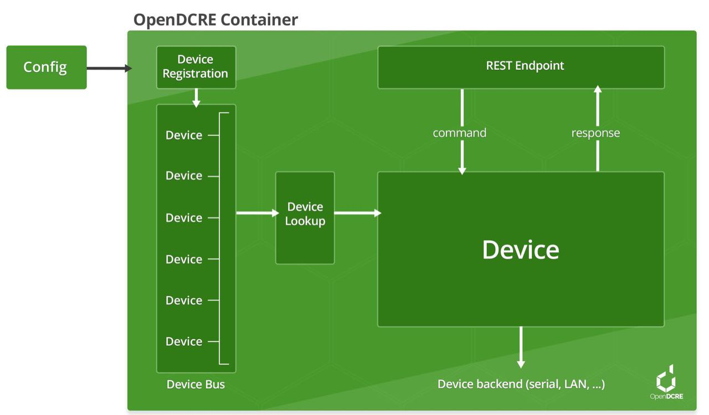

============
Introduction
============

OpenDCRE provides a securable RESTful API for monitoring and out-of-band management of data center and IT equipment.
It can be configured to use power line communications (PLC) over a DC bus bar, IPMI over LAN, or Redfish over LAN. The
OpenDCRE API is easy to integrate into third-party monitoring, management, and orchestration providers while
providing a simple ``curl``-able interface for common and custom devops tasks.

.. note::
    Redfish support in OpenDCRE (v1.3.0) is still under development and testing, so it should be treated as a
    beta feature.

Features
--------

- Simple ``curl``-able RESTful API
- Analog and digital sensor support (temperature, thermistor, humidity, fan speed, pressure).
- Power control and status, including power consumption and power supply status.
- Asset information for servers.
- Physical and chassis location awareness.
- Fan speed control and status.
- Chassis "identify" LED control and status.
- System boot target selection (hdd, pxe).
- Securable via TLS/SSL.
- Integration with existing Auth providers (OAuth, LDAP, AD, etc.).
- Power line communications (PLC)  - all OpenDCRE commands can use PLC over a DC bus bar as transport layer.
- IPMI Bridge - all OpenDCRE commands can use IPMI 2.0 over LAN as transport layer.
- Redfish support (beta) - all OpenDCRE commands can use Redfish over LAN as transport layer.

Architecture
------------

OpenDCRE is a Dockerized service designed to run in a microservice architecture. It exposes a RESTful API via
an HTTP endpoint in the OpenDCRE container. The HTTP endpoint is comprised of Nginx as the front-end with uwsgi
as a reverse proxy for a Python Flask application. Within the Flask application, OpenDCRE a modular "device bus"
definitions to define their own protocol-specific backends. The OpenDCRE endpoint routes and dispatches incoming
commands to the appropriate device bus for handling.

The OpenDCRE device bus is comprised of a set of boards and devices, individually addressable, and globally scannable
for a real-time inventory of addressable devices. The OpenDCRE device bus allows devices to be read and written, and
for various actions to be carried out, such as power control (on/off/cycle/status). Additionally, when a physical
OpenDCRE device bus is not present, a software emulator can be used to simulate OpenDCRE API commands and functionality.

All included components of OpenDCRE can be customized, integrated and secured via configuration file (nginx, uwsgi),
and output their logs to a common location (/logs).

Applications
------------

OpenDCRE can be used as an open platform for monitoring and managing data center hardware, software and
environmental characteristics. Since OpenDCRE is Dockerized, there are a wide variety of options for deployments,
integrations, network connectivity, etc. Community support helps OpenDCRE grow, and enables new functionality.
