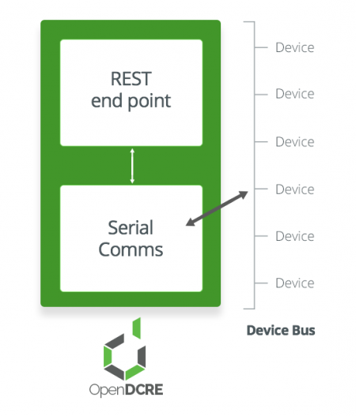

============
Introduction
============

OpenDCRE provides a securable RESTful API for monitoring and control of data center and IT equipment, including reading sensors and server power control - via power line communications (PLC) over a DC bus bar, or via IPMI over LAN. The OpenDCRE API is easy to integrate into third-party monitoring, management and orchestration providers, while providing a simple, curl-able interface for common and custom devops tasks.

Features
--------

- Analog sensor support (Thermistor)
- Power control and status via power-line communications (PLC)
- IPMI Bridge - power control and status via IPMI
- Asset information for servers (``power`` devices - PLC and IPMI)
- Simple curlable RESTful API
- Securable via TLS/SSL
- Integration with existing Auth providers (OAuth, LDAP, AD, etc.)

Architecture
------------

OpenDCRE is part of the OpenMistOS Linux distribution that runs on the Raspberry Pi 2 Model B.  OpenMistOS includes a custom Docker package, compiled for ARMv7 (armhf), and OpenDCRE is packaged as a Docker container.

OpenDCRE exposes a RESTful API via an HTTP endpoint in the OpenDCRE container.  The HTTP endpoint is comprised of nginx as the front-end, with uwsgi as a reverse proxy for a Python Flask application.  Within Flask, OpenDCRE uses a text-based serial protocol to communicate with the OpenDCRE device bus, which is the primary communications channel between API users and the device bus.  

The OpenDCRE device bus is comprised of a set of boards and devices, individually addressable, and globally scannable for a real-time inventory of addressable devices attached to the bus.  The OpenDCRE device bus allows devices to be read and written, and for various actions to be carried out, such as power control (on/off/cycle/status).  Additionally, when a physical OpenDCRE device bus is not present, a software emulator can be used to simulate OpenDCRE API commands and functionality.

All included components of OpenDCRE can be customized, integrated and secured via configuration file (nginx, uwsgi), and output their logs to a common location (/var/log/opendcre).

Applications
------------

OpenMistOS and OpenDCRE can be used as an open platform for monitoring and managing data center hardware, software and environmental characteristics. Given the small form-factor of the Raspberry Pi plus its HAT board, there are a wide variety of possible applications, deployments, physical mounting strategies, and network connectivity options.  Community support helps OpenDCRE grow, and enables new functionality.

OpenMistOS
----------

OpenMistOS (OMOS) is an open-source operating system distribution for the Raspberry Pi, featuring OpenDCRE, the Open Data Center Runtime Environment.  OMOS was developed for the purpose of using a small, single-board computer like the Raspberry Pi to perform data center sensorfication and control, particularly in concert with OpenCompute-based open hardware.

OMOS is Debian (wheezy)-based, featuring Docker capabilities baked into the OS, with OpenDCRE running as a Dockerized service of the OS.  OpenMistOS was developed by a team with decades of experience in data centers large and small, and is working to take the pain out of proprietary and arcane technologies.
